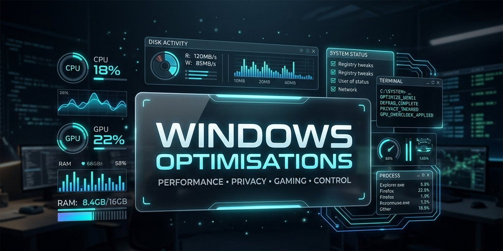

<div align="center">

# ⚡ WINDOWS OPTIMISATIONS ⚡
### PERFORMANCE • PRIVACY • GAMING • CONTROL



<br>

<p align="center">
  
  
  
  
  
  
  
</p>

*A premium, flagship open-source control platform engineered to maximize raw hardware potential, eradicate system latency, and restore absolute privacy.*

---

```text
╔═══════════════════════════════════════════════════════════════════╗
║                 S Y S T E M   S T A T U S : O N L I N E           ║
╠═══════════════════════════════════════════════════════════════════╣
║  [+] PERFORMANCE MODULES     [██████████████████████]  ACTIVE     ║
║  [+] GAMING OPTIMIZATIONS    [██████████████████████]  ENABLED    ║
║  [+] PRIVACY HARDENING       [██████████████████████]  ACTIVE     ║
║  [+] RESTORE ENGINE          [██████████████████████]  READY      ║
║  [+] WINDOWS 10 INTEGRATION  [██████████████████████]  VERIFIED   ║
║  [+] WINDOWS 11 INTEGRATION  [██████████████████████]  VERIFIED   ║
╚═══════════════════════════════════════════════════════════════════╝
```
</div>

---

## ⬛ CORE PHILOSOPHY

Windows Optimisations is not a blind tweaking tool. It is a precise, modular engineering framework designed for power users who demand total system transparency. Modern operating systems are saturated with background telemetry, unnecessary scheduled tasks, and sub-optimal resource allocation. This repository exists to place the control back into the hands of the hardware owner.

## ⬛ WHY THIS REPOSITORY EXISTS

The Windows optimization ecosystem is heavily polluted with closed-source, automated "debloaters" that run hidden scripts and break essential OS features. This platform was engineered from the ground up to counter that trend. 

In **v5.0.0**, we evolved from a directory of loose scripts into a native **WPF-based GUI Dashboard**. This provides the ease of use of a commercial application (just double-click `Start.bat`) while retaining the absolute transparency of open-source PowerShell scripts.

Every tweak, script, and registry edit in this repository is plain-text, manually inspectable, structurally organized, and rigorously tested. This is a cyber-tech toolkit built for reliability and peak performance without compromising operating system integrity.

## ⬛ OPTIMIZATION PHILOSOPHY

> **Trust, Transparency, and Reversibility.**

This repository explicitly rejects and avoids:
*   ❌ Fake FPS myths and snake-oil placebo tweaks
*   ❌ Dangerous, undocumented registry spam
*   ❌ Irreversible modifications that shatter core Windows functionality
*   ❌ Shady compiled binaries or hidden executables

Instead, every modification strictly adheres to our engineering standards:
*   ✅ **Transparent:** Pure XAML and PowerShell. No third-party binaries.
*   ✅ **Native UI:** Hardware-accelerated WPF dashboard for zero-friction execution.
*   ✅ **Reversible:** Built-in safeguards and automated registry snapshots.
*   ✅ **Observable:** Live `.NET` telemetry right in the dashboard.

---

## ⬛ MAIN FEATURE MODULES

<div align="center">
  
| MODULE | DOMAIN | FUNCTIONALITY |
| :--- | :--- | :--- |
| 🎮&nbsp;**GAMING** | Execution | Forces dedicated resources, disables background polling, lowers input latency |
| 🛡️&nbsp;**PRIVACY** | Security | Severs Microsoft telemetry connections, hardens microphone/camera permissions |
| ⚡&nbsp;**STARTUP** | Boot | Eliminates non-critical boot sequences for instantaneous OS initialization |
| 🌐&nbsp;**NETWORK** | Connectivity | Adjusts TCP parameters and Delivery Optimization caps for lower ping |
| 📦&nbsp;**STORAGE** | File System | Unlocks deep SSD optimizations and aggressive cache purges |
| 🖥️&nbsp;**DISPLAY** | Rendering | Tunes desktop window manager (DWM) and bypasses fullscreen optimizations |
| 🔧&nbsp;**DIAGNOSTICS** | Troubleshooting | Safe-mode toggles, component isolation, and diagnostic metric collection |
| 🌙&nbsp;**BROWSER** | Web | Eradicates background WebView/Edge bloat and background updating processes |

</div>

---

## ⬛ REPOSITORY ARCHITECTURE

A clean, futuristic blueprint of the optimization matrix. 

```text
📦 Windows-Optimisations
 ┣ 📜 Start.bat                # [ENTRY] The zero-friction launcher for the GUI
 ┣ 📂 GUI/                     # [INTERFACE] The native WPF Dashboard XAML
 ┣ 📂 Launchers/               # [CONTROLLERS] The PowerShell logic binding the GUI
 ┣ 📂 Tweaks/                  # [CORE] The primary system optimization engine
 ┃  ┣ 📂 Appearance/           # UI decluttering and hardware-accelerated rendering profiles
 ┃  ┣ 📂 Background/           # Background process suspension and app termination logic
 ┃  ┣ 📂 Browser/              # Chromium/Edge background telemetry annihilation
 ┃  ┣ 📂 Display/              # Fullscreen focus overrides and GPU preference routing
 ┃  ┣ 📂 Gaming/               # Game Mode enforcement and interrupt moderation tuning
 ┃  ┣ 📂 Network/              # Bandwidth unthrottling and telemetry firewalling
 ┃  ┣ 📂 Privacy/              # Deep system telemetry blacks (Mic, Camera, Metadata)
 ┃  ┣ 📂 Startup/              # Boot latency reduction and auto-start suppression
 ┃  ┣ 📂 Storage/              # Disk I/O caching and automated indexer bloat removal
 ┃  ┗ 📂 Windows/              # Core OS scheduler and task prioritization hooks
 ┣ 📂 Core/                    # [INFRASTRUCTURE] Logging, state capture, and restore manifests
 ┣ 📂 Activators/              # KMS38 and HWID activation provisioning
 ┣ 📂 Antivirus/               # Elite security deployment frameworks
 ┣ 📂 Browsers/                # Hardened, privacy-first web browsers
 ┣ 📂 Drivers/                 # Next-gen hardware detection and driver initialization
 ┣ 📂 Hardware/                # Deep hardware telemetry probes (CPU-Z, GPU-Z, HWMonitor)
 ┣ 📂 Windows Update/          # Absolute granular control over OS update channels
 ┗ 📂 docs/                    # [KNOWLEDGE] The central intelligence wiki
```

---

## ⬛ OPTIMIZATION CATEGORIES

### 🎮 Gaming Optimization
Designed specifically for competitive environments where input lag is fatal. These tweaks force Windows to respect fullscreen exclusivity, prioritize game rendering threads above all background tasks, and disable interruptive background polling routines.

### 🖥️ Display Optimization
Overrides standard Desktop Window Manager (DWM) behaviors. Adjusts multiplane overlays (MPO) and bypasses unnecessary visual scaling processes to ensure frame pacing remains completely stable.

### ⚡ Startup Optimization
Strips away the massive list of bloatware that injects itself into the boot sequence. Focuses purely on critical OS services, dramatically reducing cold-boot times to seconds.

### 🛑 Background Apps Management
Annihilates UWP (Universal Windows Platform) background applications. Reclaims wasted CPU cycles and RAM by denying apps the ability to run in suspended states unless explicitly launched.

### 📦 Storage Optimization
Includes aggressive disk maintenance scripts. Flushes deep systemic caches, invalid prefetch data, and Windows Update leftovers that traditional disk cleanup utilities ignore.

### 🌐 Network Optimization
Optimizes the TCP/IP stack for raw throughput and low latency. Disables Windows Delivery Optimization (P2P updates) to ensure your bandwidth is never hijacked mid-game.

### 🌙 Browser Optimization
Focuses heavily on taming Microsoft Edge and WebView2 runtimes. Prevents Chromium-based engines from perpetually running telemetry and update services in the background.

### 🛡️ Privacy Hardening
A systemic lock-down of Windows data exfiltration. Disables advertising IDs, cortana indexing, diagnostic data uploads, and restricts app access to location, camera, and microphone hardware.

### 🔧 Troubleshooting Toolkit
If an issue arises, the system features a dedicated troubleshooting module containing rapid diagnostic scripts, network resets, and clean boot environment toggles to isolate hardware vs. software faults.

---

## ⬛ SAFETY & RESTORE SYSTEM

> **CRITICAL ARCHITECTURE NOTE**

Absolute power requires absolute safety. This repository is built upon a **Reversible Tweaks Architecture**. 
We do not believe in permanent, destructive modifications. 

1. **System Restore Integration:** The execution sequence aggressively promotes the creation of Windows System Restore points prior to applying *any* module.
2. **Reversible Registry:** Wherever a registry key is modified, its exact default counterpart is strictly documented or provided.
3. **Modular Control:** By utilizing separate `.reg` and `.bat` files for specific categories (e.g., *only* Network, or *only* Privacy), you retain the power to test and isolate changes safely.

---

## ⬛ DOCUMENTATION

Our complete documentation exists as a beautifully crafted, live dashboard interface. Access the archives to understand the deep technical reasoning behind every script.

🔗 **[ACCESS THE LIVE DASHBOARD](https://windows-optimizations.netlify.app/)**

---

## ⬛ USAGE GUIDE

> [!NOTE]  
> **ELEVATED PRIVILEGES REQUIRED:** All optimization modules must interface directly with the Windows Kernel, Registry, and Services layer. The launcher will automatically request Administrator rights upon execution.

1. **Download the Release**  
   Download the latest ZIP release and extract all files to a secure directory (e.g., `C:\Optimizations`).
2. **Launch the Dashboard**  
   Double-click the `Start.bat` file located in the root directory. 
3. **First-Run Initialization**  
   The framework will gracefully initialize, offer to create a native Windows System Restore point for absolute safety, and place a shortcut on your Desktop.
4. **Deploy Profiles**  
   Use the stunning new WPF Dashboard to apply your desired Optimization Profiles, monitor real-time System Telemetry, or safely roll back any changes via the integrated Rollback Engine tab.

---

## ⬛ COMPATIBILITY MATRIX

| ENVIRONMENT / FEATURE | STATUS | INTEGRATION LEVEL |
| :--- | :---: | :--- |
| **Windows 10 (22H2)** | 🟢 VERIFIED | Native Full Support |
| **Windows 11 (23H2)** | 🟢 VERIFIED | Native Full Support |
| **Windows 11 (24H2)** | 🟢 VERIFIED | Native Full Support |
| **Windows 11 (25H2)** | 🟢 VERIFIED | Native Full Support |
| **Copilot+ Devices** | 🟡 PARTIAL | ARM64 Analysis Ongoing |
| **HDR Calibration** | 🟢 VERIFIED | Display Tuned |
| **Auto SR Support** | 🟢 VERIFIED | Hardware Accelerated |

---

## ⬛ WARNINGS

> [!WARNING]  
> This toolkit modifies core operating system behaviors. 
> * Do not execute these scripts blindly on enterprise or domain-managed corporate networks.
> * Aggressive telemetry disabling may interfere with Windows Insider feedback pipelines.
> * Proceed with knowledge, and always maintain a tested rollback strategy.

---

## ⬛ ADVANCED NOTES

For deep systems engineers: Review the `autounattend.xml` file. This blueprint allows you to bake these optimizations directly into a fresh Windows ISO installation, completely bypassing TPM/Secure Boot checks and skipping Microsoft Account enforcement (OOBE bypass).

---

## ⬛ CONTRIBUTING

We welcome pull requests from fellow system engineers and optimization enthusiasts. All submitted tweaks must meet our philosophy: they must be documented, they must be reversible, and they must demonstrate a measurable technical benefit. 

---

## ⬛ CREDITS

> **Farhan // System Architect**
> *Mission:* Eradicate software bloat. Maximize raw hardware performance. Restore absolute user control.
>
> 📡 **GitHub:** [@YTxFSGAMERz](https://github.com/YTxFSGAMERz)  
> 📡 **Telegram Network:** [Access News Feed](https://t.me/YTxFSGAMERz)  
> 📡 **Direct WhatsApp COMMS:** [Initialize Connection](https://wa.me/917778906798)

Engineered, tested, and maintained by **Farhan**. 
Leveraging the power of the open-source community to keep hardware fast, clean, and private.

---

## ⬛ END OF FILE

<div align="center">

`[ SYSTEM OPTIMIZATION SEQUENCE COMPLETE ]`

</div>
